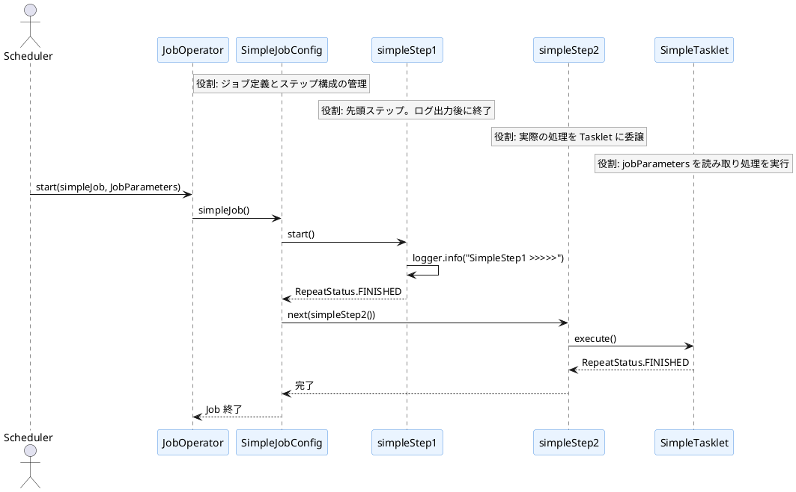
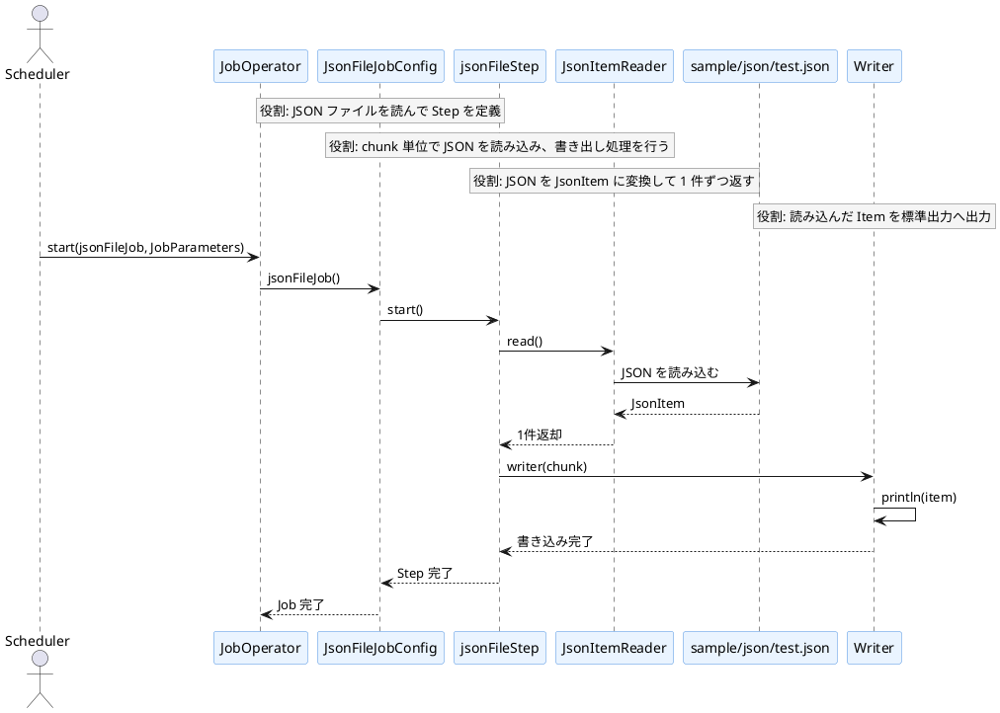
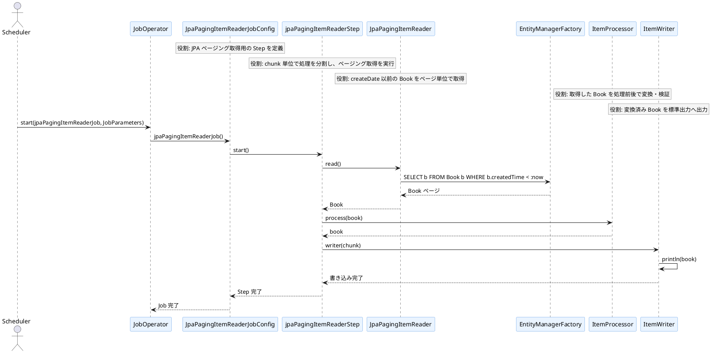
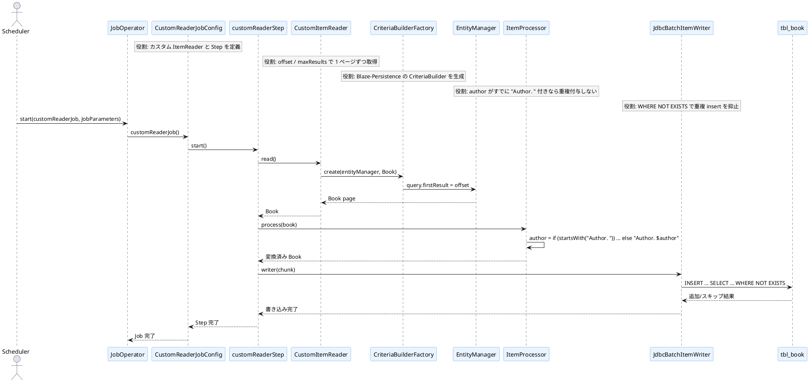

# バッチ処理フロー（JOB ごとのシーケンス図）

このファイルでは、各ジョブを独立した PlantUML シーケンス図としてまとめています。

## 1. SIMPLE_JOB
処理概要: シンプルな Tasklet ベースのジョブ。2つのステップを順に実行し、ログ出力と処理終了を確認する。

## 2. JSON_FILE_JOB
処理概要: ClassPath 上の JSON ファイルを読み込み、JsonItem を生成してチャンク単位で標準出力へ出力するジョブ。

## 3. JPA_PAGING_IR_JOB
処理概要: JPA の JpaPagingItemReader を使って Book をページング取得し、条件付きで古いデータを読み出すジョブ。

## 4. CUSTOM_READER_JOB
処理概要: Blaze-Persistence を使って Book をページング取得し、author を加工したうえで、重複抑止付きの SQL でレコードを保存するジョブ。

補足:
- SIMPLE_JOB は Tasklet ベースのシンプルな実行フローです。
- JSON_FILE_JOB は ClassPath の JSON を読み取る構成です。
- JPA_PAGING_IR_JOB はページング読み取りでデータベースから Book を取得します。
- CUSTOM_READER_JOB は Blaze-Persistence の CriteriaBuilder を使ってページング取得し、再実行時の重複を避ける実装です。

## 依存関係と運用上の注意
- Spring Boot 4.1.1 では Hibernate 7 系が使われるため、Blaze の Hibernate 7.1 向けモジュールを使用する。
- PostgreSQL JDBC は 42.7.13 まで更新しており、脆弱性報告の対象となる 42.7.4 ではないことを確認している。
- 依存の組み合わせは `hibernate-core 7.4.5.Final` と `blaze-persistence-integration-hibernate-7.1:1.6.20` が解決される構成を前提にしている。
- `CUSTOM_READER_JOB` は再実行時の二重登録を避けるため、author の prefix 重複抑止と `WHERE NOT EXISTS` を併用している。
