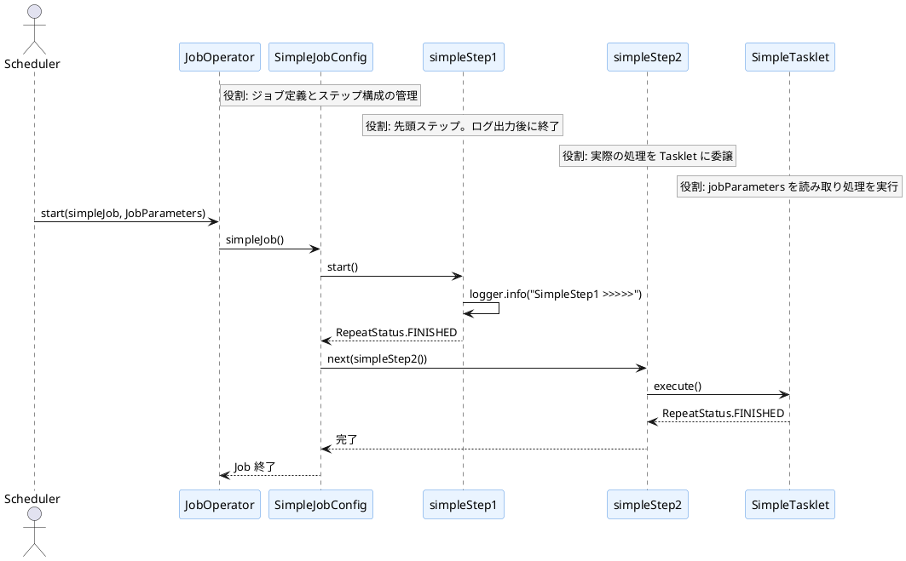
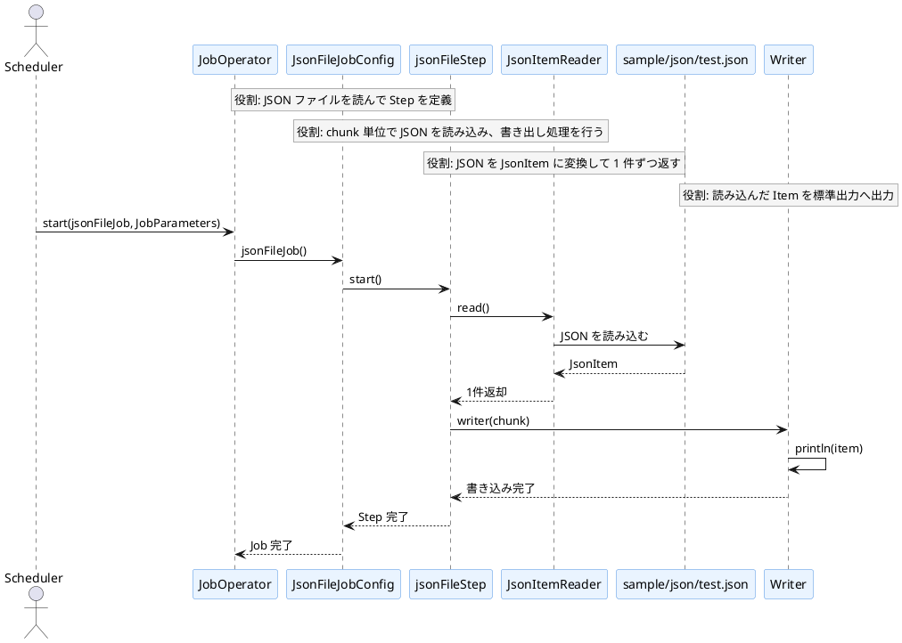
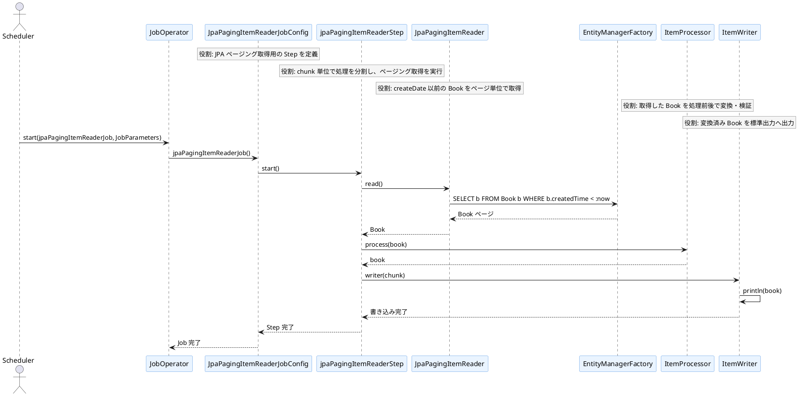
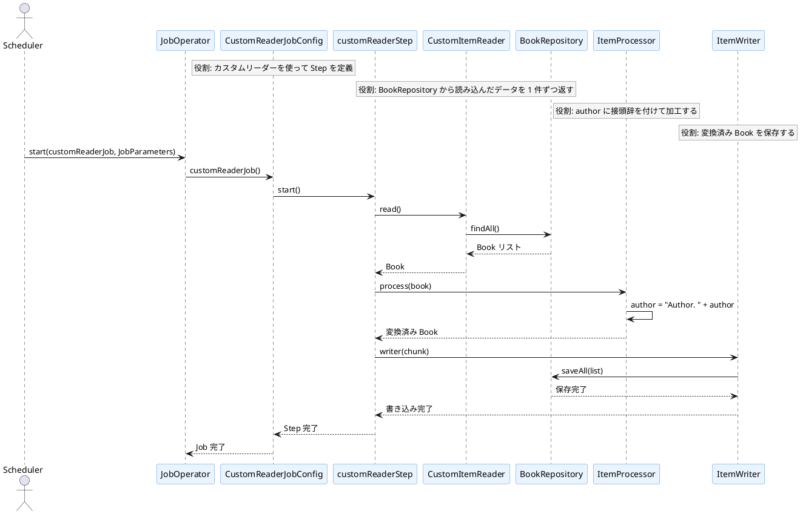

# バッチ処理フロー（JOB ごとのシーケンス図）

このファイルでは、各ジョブを独立した PlantUML シーケンス図としてまとめています。

## 1. SIMPLE_JOB
処理概要: シンプルな Tasklet ベースのジョブ。2つのステップを順に実行し、ログ出力と処理終了を確認する。

## 2. JSON_FILE_JOB
処理概要: ClassPath 上の JSON ファイルを読み込み、JsonItem を生成してチャンク単位で標準出力へ出力するジョブ。

## 3. JPA_PAGING_IR_JOB
処理概要: JPA の JpaPagingItemReader を使って Book をページング取得し、条件付きで古いデータを読み出すジョブ。

## 4. CUSTOM_READER_JOB
処理概要: 独自の ItemReader を使用し、DB の Book を読み込み、author を加工して保存するジョブ。

補足:
- SIMPLE_JOB は Tasklet ベースのシンプルな実行フローです。
- JSON_FILE_JOB は ClassPath の JSON を読み取る構成です。
- JPA_PAGING_IR_JOB はページング読み取りでデータベースから Book を取得します。
- CUSTOM_READER_JOB は独自の ItemReader と処理済みデータを DB に保存します。
